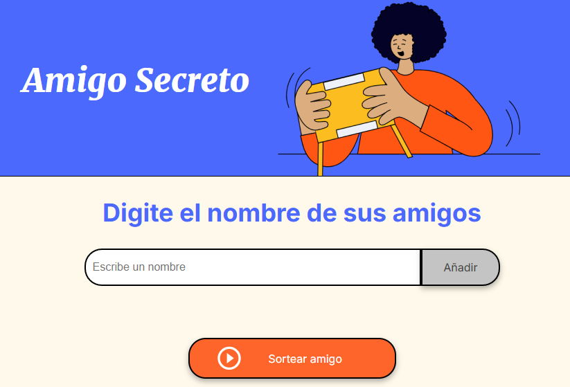
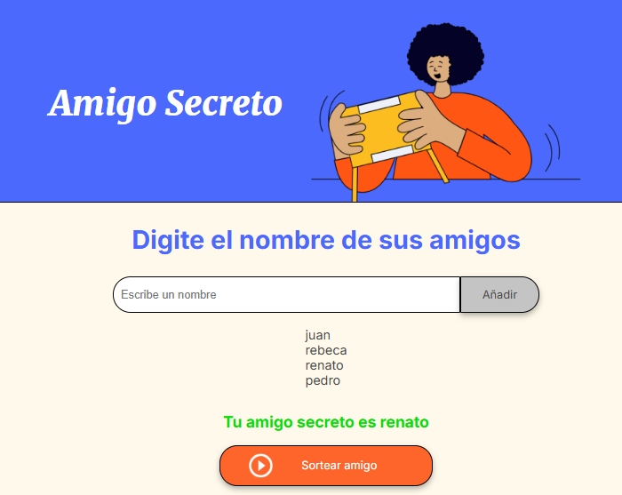

# Amigo Secreto

<p align="left">
   
</p>

_Desarrollo de una aplicación que permita a los usuarios ingresar nombres de amigos en una lista para luego realizar un sorteo aleatorio y determinar quién es el "amigo secreto"._

## Comenzando 🚀

_Estas instrucciones te permitirán obtener una copia del proyecto en funcionamiento en tu máquina local para propósitos de desarrollo y pruebas._

### Instalación 🔧

```sh
git clone https://github.com/laleska2506/Challenge-Amigo-Secreto.git
```

_Finaliza con un ejemplo de cómo obtener datos del sistema o como usarlos para una pequeña demo_

## :hammer:Funcionalidades del proyecto ⚙️

- `Agregar nombres`: Los usuarios escribirán el nombre de un amigo en un campo de texto y lo agregarán a una lista visible al hacer clic en "Adicionar".
- `Validar entrada`: Si el campo de texto está vacío, el programa mostrará una alerta pidiendo un nombre válido.
- `Visualizar la lista`: Los nombres ingresados aparecerán en una lista debajo del campo de entrada.
- `Sorteo aleatorio`: Al hacer clic en el botón "Sortear Amigo", se seleccionará aleatoriamente un nombre de la lista y se mostrará en la página.

## Capturas 📦
 
  

### 5️⃣ **🛠️ Tecnologías Utilizadas**  

- HTML5  
- CSS3  
- JavaScript  

## Autores ✒️

* **Laleska Arroyo** - *Trabajo Inicial* - [laleska](https://github.com/laleska2506)

## 📜 Licencia  
Este proyecto está bajo la licencia MIT - consulta el archivo [LICENSE](LICENSE) para más detalles.

## Expresiones de Gratitud 🎁

* Comenta a otros sobre este proyecto 📢
* Invita una cerveza 🍺 o un café ☕ a alguien del equipo. 
* Da las gracias públicamente 🤓.
* Dona con cripto a esta dirección: `0xf253fc233333078436d111175e5a76a649890000`
* etc.
